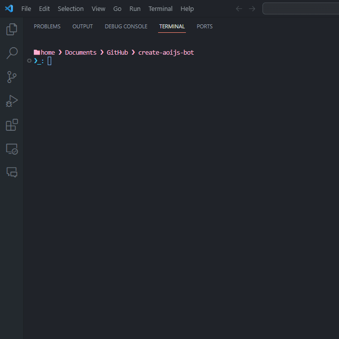

# aoi.js CLI 

aoi.js CLI is used to create and setup your project with ease! Get started by following the steps below.

## Features

- **Template Selection:** Choose from various bot setup options including the Default setup, a setup with handler, a setup using sharding or a setup using aoi.js extensions!
- **Package Installation:** Automatically installs necessary packages such as aoi.js and aoi.music based on user preferences.
- **Easy Setup:** Simplifies the process for beginners and saves time for experienced developers.

## Installation

To use the aoi.js CLI, ensure you have [Node.js](https://nodejs.org/) installed on your system.


Get started by executing:

```bash
npm create aoijs-bot
```

You can also install the tool globally via npm:

```bash
npm install -g create-aoijs-bot
```

## Usage

To generate a bot template, open your terminal and run the following command:

```bash
npm create aoijs-bot
```

or with npx:

```bash
npx create-aoijs-bot
```

If you ran the install command via `npm install` you can also execute it directly:

```bash
create-aoijs-bot
```

Follow the prompts to select your desired bot setup, and you're ready to go!

### Command Arguments

You can display all available args with `create-aoijs-bot --help`.


